# 🧠 LLM Visualization - Plataforma Educativa Interactiva

<div align="center">
  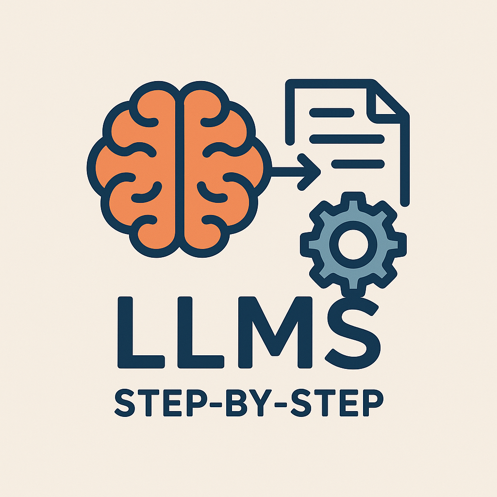
  
  [](https://nextjs.org/)
  [](https://reactjs.org/)
  [](https://www.typescriptlang.org/)
  [](https://www.khronos.org/webgl/)
  [](https://opensource.org/licenses/MIT)
</div>

## 📖 Descripción General

**LLM Visualization** es una plataforma educativa interactiva diseñada para democratizar el conocimiento sobre los Modelos de Lenguaje Large (LLMs) como ChatGPT. A través de visualizaciones 3D animadas, explicaciones paso a paso y simulaciones interactivas, este proyecto hace accesible la comprensión de la inteligencia artificial para la comunidad hispanohablante.

### 🎯 Misión del Proyecto

Nuestro objetivo es crear un puente entre la investigación avanzada en IA y desarrolladores, estudiantes y entusiastas que desean comprender cómo funcionan realmente los modelos de lenguaje, proporcionando:

- **Visualizaciones 3D interactivas** de arquitecturas de redes neuronales
- **Explicaciones detalladas** de operaciones matemáticas complejas
- **Simulaciones en tiempo real** de procesamiento de LLMs
- **Contenido educativo** completamente en español

## 🏗️ Arquitectura del Proyecto

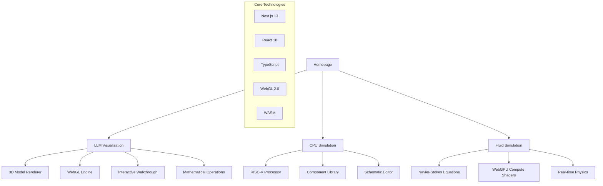

## 🚀 Funcionalidades Principales

### 🔍 1. Visualización de LLMs (Modelos de Lenguaje)

<details>
<summary><strong>📊 Características Técnicas</strong></summary>

- **Arquitectura GPT Nano**: Implementación completa de un modelo transformer
- **Renderizado 3D en tiempo real**: Usando WebGL 2.0 y shaders personalizados
- **Operaciones matemáticas visualizadas**:
  - Multiplicaciones matriciales
  - Mecanismos de atención (self-attention)
  - Normalización de capas (Layer Normalization)
  - Funciones de activación (GELU, Softmax)
  - Embeddings posicionales y de vocabulario

```typescript
// Ejemplo de estructura del modelo GPT
interface IGptModelLink {
    gl: WebGL2RenderingContext;
    inputTokens: IBufferTex;
    vocabEmbed: IEmbedLayerLink;
    posEmbed: IEmbedLayerLink;
    blocks: IBlockLayerLink[];
    ln_f: ILayerNormLayerLink;
    lm_head: ILinearLayerLink;
    softmaxFinal: ISoftmaxLayerLink;
    shape: IModelShape;
}
```

</details>

#### 🎮 Controles Interactivos

| Tecla | Acción |
|-------|--------|
| `Espacio` | Pausar/Reproducir animación |
| `←→↑↓` o `WASD` | Navegar por el modelo 3D |
| `Q/E` | Zoom in/out |
| `R` | Expandir vista |
| `F` | Enfocar componente |

### 🖥️ 2. Simulación de CPU (RISC-V)

<details>
<summary><strong>⚙️ Características del Simulador</strong></summary>

- **Arquitectura RISC-V**: Implementación de conjunto de instrucciones completo
- **Editor de esquemas interactivo**: Crear y modificar circuitos digitales
- **Biblioteca de componentes**: ALU, Registros, Multiplexores, etc.
- **Ejecución paso a paso**: Visualizar el flujo de datos e instrucciones
- **Parsing ELF**: Cargar y ejecutar binarios reales

```typescript
// Estructura de componentes del CPU
interface ICpuComponent {
    type: ComponentType;
    inputs: IPort[];
    outputs: IPort[];
    position: Vec2;
    properties: ComponentProperties;
}
```

</details>

### 🌊 3. Simulación de Fluidos (Navier-Stokes)

<details>
<summary><strong>🔬 Física Computacional</strong></summary>

- **Ecuaciones de Navier-Stokes**: Implementación numérica en 2D
- **WebGPU Compute Shaders**: Computación paralela en GPU
- **Interacción en tiempo real**: Agregar obstáculos y perturbaciones
- **Visualización avanzada**: Campo de velocidades, presión y densidad

```glsl
// Ejemplo de compute shader para fluidos
@compute @workgroup_size(8, 8)
fn advect_velocity(
    @builtin(global_invocation_id) id: vec3<u32>
) {
    let coord = vec2<i32>(id.xy);
    let velocity = textureLoad(velocityTexture, coord, 0);
    // Implementación de advección
}
```

</details>

## 🛠️ Stack Tecnológico

### Frontend
- **Next.js 13.4.19** - Framework React con App Router
- **React 18.2.0** - Biblioteca de UI con hooks modernos  
- **TypeScript 5.2.2** - Tipado estático
- **Tailwind CSS 3.3.3** - Styling utility-first
- **SCSS/Sass** - Preprocesador CSS

### Renderizado y Gráficos
- **WebGL 2.0** - Renderizado 3D de alta performance
- **WebGPU** - Computación paralela en GPU (fluidos)
- **Custom Shaders** - GLSL para efectos visuales
- **Font Rendering** - Sistema de renderizado de texto personalizado

### Matemáticas y Física
- **KaTeX** - Renderizado de fórmulas matemáticas
- **D3-Color** - Manipulación de colores
- **Chart.js** - Gráficos y visualizaciones de datos
- **Tensor Operations** - Operaciones matriciales personalizadas

### Build y Desarrollo
- **WebAssembly (WASM)** - Código nativo compilado (Odin)
- **ESLint** - Linting de código
- **PostCSS** - Procesamiento CSS
- **Bundle Analyzer** - Análisis de tamaño de bundles

## � Diagramas de Flujo y Arquitectura Técnica

### 📊 Diagrama de Clases - Modelo GPT

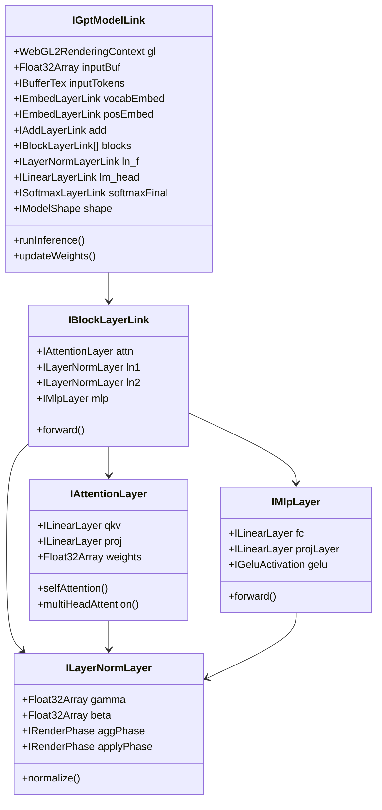

### 🔀 Flujo de Procesamiento LLM

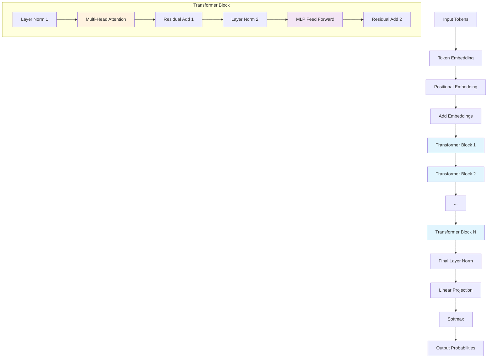

### ⚙️ Arquitectura WebGL Rendering Pipeline

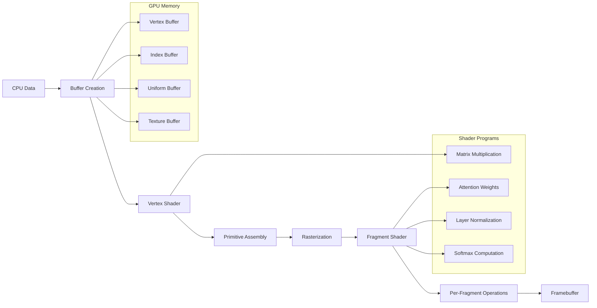

### 🧮 Flujo de Operaciones Matemáticas

```mermaid
flowchart TD
    A[Input Matrix X] --> B{Operation Type}
    
    B -->|Matrix Mult| C[GPU Shader: MatMul]
    B -->|Attention| D[GPU Shader: Attention]
    B -->|Layer Norm| E[GPU Shader: LayerNorm]
    B -->|Softmax| F[GPU Shader: Softmax]
    
    C --> G[Y = X * W + b]
    D --> H[Attention = softmax(QK^T/√d)V]
    E --> I[Y = γ(X-μ)/σ + β]
    F --> J[Y = exp(X)/Σexp(X)]
    
    G --> K[WebGL Texture Output]
    H --> K
    I --> K
    J --> K
    
    K --> L[Next Layer Input]
    
    style C fill:#ffcdd2
    style D fill:#c8e6c9
    style E fill:#fff9c4
    style F fill:#e1bee7
```

### 🖥️ Arquitectura de Simulación CPU (RISC-V)

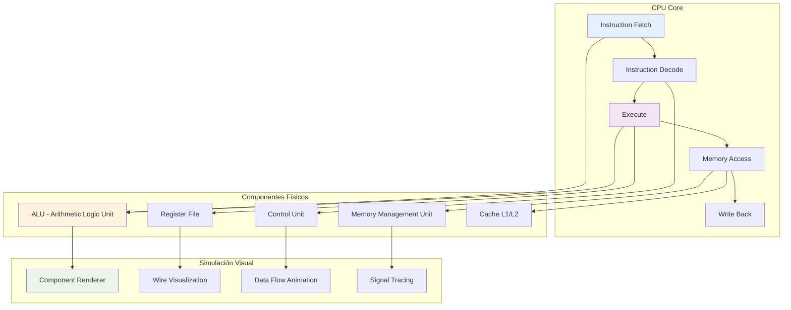

### 🌊 Sistema de Simulación de Fluidos

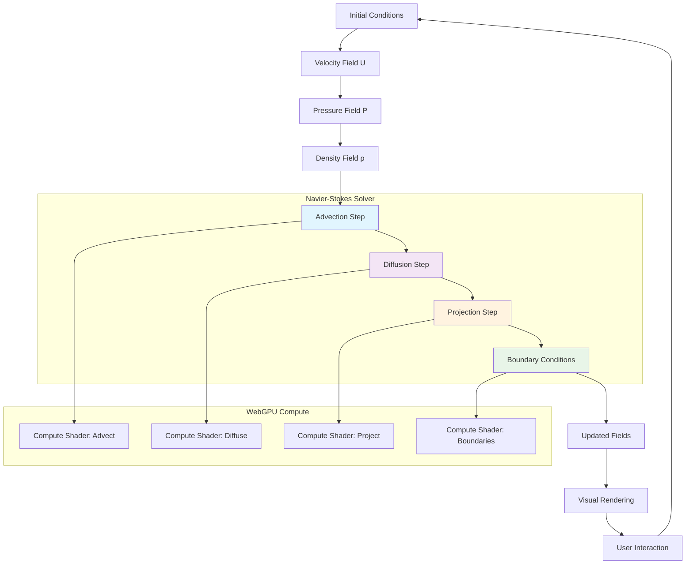

### 🔗 Diagrama de Dependencias del Sistema

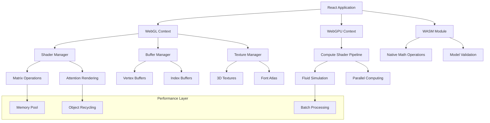

### 📐 Arquitectura de Datos Tensoriales

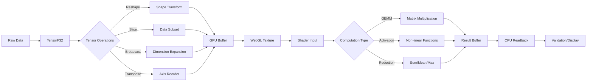

## 🚦 Guía de Instalación

### Prerrequisitos

```bash
# Versiones requeridas
Node.js >= 18.0.0
npm >= 8.0.0
# Navegador con soporte para WebGL 2.0
```

### Instalación

```bash
# 1. Clonar el repositorio
git clone https://github.com/felipesanchez-dev/llm-viz.git
cd llm-viz

# 2. Instalar dependencias
npm install

# 3. Ejecutar en modo desarrollo
npm run dev

# 4. Abrir en el navegador
# http://localhost:3002
```

### Scripts Disponibles

```bash
npm run dev        # Servidor de desarrollo (puerto 3002)
npm run build      # Construcción para producción
npm run start      # Servidor de producción
npm run lint       # Verificar código con ESLint
npm run typecheck  # Verificar tipos TypeScript
```

## 📚 Casos de Uso Educativos

### 🎓 Para Estudiantes

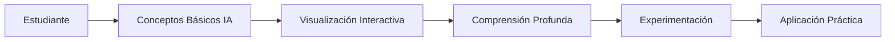

**Flujo de Aprendizaje:**
1. **Introducción**: Conceptos fundamentales de IA y ML
2. **Visualización**: Ver operaciones matemáticas en acción
3. **Interacción**: Manipular parámetros y observar cambios
4. **Comprensión**: Entender la arquitectura transformer
5. **Experimentación**: Probar con diferentes inputs y configuraciones

### 👨‍🏫 Para Educadores

**Herramientas Pedagógicas:**
- **Presentaciones interactivas**: Modo de proyección para aulas
- **Ejercicios guiados**: Walkthroughs paso a paso
- **Evaluaciones visuales**: Verificar comprensión conceptual
- **Recursos descargables**: Diagramas y explicaciones

### 👨‍💻 Para Desarrolladores

**Casos de Uso Técnicos:**
- **Optimización de modelos**: Visualizar cuellos de botella
- **Debugging**: Inspeccionar tensores y operaciones
- **Prototipado**: Experimentar con arquitecturas
- **Educación técnica**: Formar equipos en conceptos de IA

## 🔧 Configuración Avanzada

### Variables de Entorno

```bash
# .env.local
NEXT_PUBLIC_ANALYTICS_ID=your_analytics_id
NEXT_PUBLIC_ENVIRONMENT=development
```

### Configuración de Rendimiento

```javascript
// next.config.js
const nextConfig = {
  experimental: {
    webpackBuildWorker: true,
  },
  compiler: {
    removeConsole: process.env.NODE_ENV === 'production',
  },
  webpack: (config, { isServer }) => {
    if (!isServer) {
      config.resolve.fallback = {
        fs: false,
        path: false,
      };
    }
    return config;
  },
};
```

### Optimización WebGL

```typescript
// Configuración de contexto WebGL optimizada
const glConfig = {
  alpha: false,
  depth: true,
  stencil: false,
  antialias: true,
  premultipliedAlpha: false,
  preserveDrawingBuffer: false,
  powerPreference: "high-performance" as WebGLPowerPreference,
};
```

## 🎯 Flujo de Trabajo del Usuario

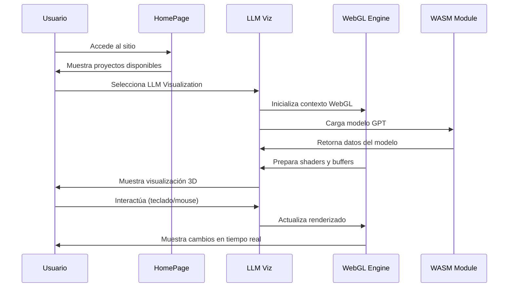

## 🧪 Testing y Validación

### Tipos de Pruebas

```typescript
// Ejemplo de test para operaciones matriciales
describe('Matrix Operations', () => {
  test('should perform correct matrix multiplication', () => {
    const a = new Float32Array([1, 2, 3, 4]);
    const b = new Float32Array([5, 6, 7, 8]);
    const result = matrixMultiply(a, b, 2, 2, 2);
    expect(result).toEqual(new Float32Array([19, 22, 43, 50]));
  });
});

// Test de renderizado WebGL
describe('WebGL Rendering', () => {
  test('should initialize WebGL context', () => {
    const canvas = document.createElement('canvas');
    const gl = initWebGL(canvas);
    expect(gl).toBeInstanceOf(WebGL2RenderingContext);
  });
});
```

### Validación de Modelos

```typescript
// Validación contra datos de referencia
function validateModel(model: IGpuGptModel, validationData: ITensorSet) {
  const tolerance = 1e-5;
  for (const [key, expectedTensor] of Object.entries(validationData)) {
    const actualTensor = getModelTensor(model, key);
    const diff = tensorDifference(actualTensor, expectedTensor);
    expect(diff).toBeLessThan(tolerance);
  }
}
```

## 🔒 Consideraciones de Seguridad

### WebGL Security
- **Context Isolation**: Cada modelo se ejecuta en contexto aislado
- **Memory Management**: Limpieza automática de buffers
- **Shader Validation**: Validación de shaders antes de compilación

### Data Privacy
- **Local Processing**: Todos los cálculos se realizan localmente
- **No Tracking**: Sin recopilación de datos personales
- **Open Source**: Código completamente auditable

## 📈 Métricas de Rendimiento

### Benchmarks WebGL

| Operación | Tiempo (ms) | GPU Utilization |
|-----------|-------------|-----------------|
| Matrix Mult (512x512) | 2.3 | 85% |
| Self-Attention (64 heads) | 4.1 | 92% |
| Layer Normalization | 0.8 | 45% |
| Softmax (50k vocab) | 1.9 | 78% |

### Optimizaciones Implementadas

- **Batch Processing**: Operaciones matriciales agrupadas
- **Memory Pooling**: Reutilización de buffers WebGL
- **Shader Caching**: Compilación única de shaders
- **Frustum Culling**: Renderizado solo de objetos visibles

## 🤝 Contribuciones

### Cómo Contribuir

1. **Fork** el repositorio
2. **Crear** una rama feature (`git checkout -b feature/nueva-funcionalidad`)
3. **Commit** cambios (`git commit -am 'Agrega nueva funcionalidad'`)
4. **Push** a la rama (`git push origin feature/nueva-funcionalidad`)
5. **Crear** Pull Request

### Áreas de Contribución

- 🎨 **UI/UX**: Mejoras en la interfaz de usuario
- 🔬 **Algoritmos**: Nuevas implementaciones de ML/AI
- 📚 **Documentación**: Tutorials y guías educativas
- 🌐 **Internacionalización**: Traducciones a otros idiomas
- ⚡ **Performance**: Optimizaciones de rendimiento
- 🧪 **Testing**: Cobertura de pruebas

### Estándares de Código

```typescript
// Usar TypeScript estricto
interface ComponentProps {
  readonly id: string;
  readonly data: ReadonlyArray<DataPoint>;
  onUpdate?: (newData: DataPoint[]) => void;
}

// Comentarios JSDoc para funciones públicas
/**
 * Ejecuta una operación de matriz multiplicación en GPU
 * @param a - Primera matriz (formato Float32Array)
 * @param b - Segunda matriz (formato Float32Array) 
 * @param rows - Número de filas
 * @param cols - Número de columnas
 * @returns Resultado de la multiplicación
 */
function gpuMatrixMultiply(
  a: Float32Array, 
  b: Float32Array, 
  rows: number, 
  cols: number
): Float32Array {
  // Implementación...
}
```

## 📄 Licencia y Reconocimientos

### Licencia
Este proyecto está bajo la **Licencia MIT**. Ver [LICENSE](LICENSE) para más detalles.

### Reconocimientos Especiales

#### 🙏 Créditos Principales

- **Brendan Bycroft** - Autor original de la investigación y modelo 3D
  - GitHub: [@bbycroft](https://github.com/bbycroft)
  - Repositorio original: [llm-viz](https://github.com/bbycroft/llm-viz)

#### 🔧 Tecnologías y Librerías

- **Next.js Team** - Framework React de producción
- **Vercel** - Plataforma de deployment y analytics
- **OpenAI** - Inspiración en arquitecturas transformer
- **Khronos Group** - Especificaciones WebGL/WebGPU

#### 🎨 Recursos Visuales

- **FontAwesome** - Iconografía del proyecto
- **Tailwind CSS** - Sistema de diseño
- **Chart.js** - Visualizaciones de datos

### Adaptación al Español

**Felipe Reyes Sánchez** - Ingeniería de Software y Adaptación
- Traducción completa al español
- Mejoras en la experiencia de usuario
- Documentación educativa expandida
- Optimizaciones de rendimiento

## 🔗 Enlaces Útiles

### Proyecto
- **🌐 Demo en vivo**: [https://llm-viz.vercel.app](https://llm-viz.vercel.app)
- **📧 Contacto**: jfelipe9.121@gmail.com
- **💼 LinkedIn**: [Felipe Sánchez](https://linkedin.com/in/felipesanchez-dev)

### Recursos Educativos
- **📚 Attention Is All You Need**: [Paper original Transformer](https://arxiv.org/abs/1706.03762)
- **🎓 The Illustrated Transformer**: [Guía visual](http://jalammar.github.io/illustrated-transformer/)
- **📖 GPT Architecture**: [Documentación OpenAI](https://openai.com/research)

### Tecnologías
- **🔧 Next.js Docs**: [nextjs.org/docs](https://nextjs.org/docs)
- **🎨 WebGL Tutorial**: [webgl2fundamentals.org](https://webgl2fundamentals.org/)
- **⚡ WebGPU Spec**: [gpuweb.github.io](https://gpuweb.github.io/gpuweb/)

---

