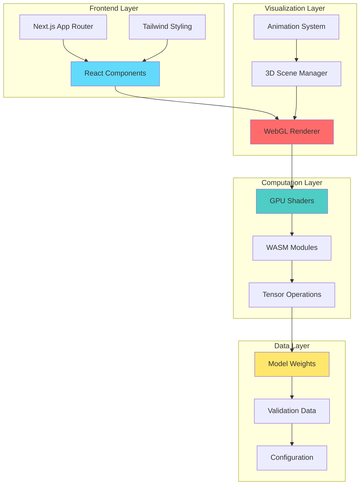

# 🧠 LLM Visualization - Plataforma Educativa Interactiva

<div align="center">
  
  
  <!-- Technology Badges -->
  [](https://nextjs.org/)
  [](https://reactjs.org/)
  [](https://www.typescriptlang.org/)
  [](https://www.khronos.org/webgl/)
  [](https://webassembly.org/)
  
  <!-- Repository Stats -->
  
  
  
  
  <!-- Project Stats -->
  
  
  
  
  <!-- License -->
  [](https://opensource.org/licenses/MIT)
  
  <!-- Live Demo -->
  [](https://llm-viz.vercel.app)
  
</div>

## Descripción General

**LLM Visualization** es una plataforma educativa interactiva diseñada para democratizar el conocimiento sobre los Modelos de Lenguaje Large (LLMs) como ChatGPT. A través de visualizaciones 3D animadas, explicaciones paso a paso y simulaciones interactivas, este proyecto hace accesible la comprensión de la inteligencia artificial para la comunidad hispanohablante.

### Misión del Proyecto

Nuestro objetivo es crear un puente entre la investigación avanzada en IA y desarrolladores, estudiantes y entusiastas que desean comprender cómo funcionan realmente los modelos de lenguaje, proporcionando:

-   **Visualizaciones 3D interactivas** de arquitecturas de redes neuronales
-   **Explicaciones detalladas** de operaciones matemáticas complejas
-   **Simulaciones en tiempo real** de procesamiento de LLMs
-   **Contenido educativo** completamente en español

## Arquitectura del Proyecto


## Funcionalidades Principales

### 1. Visualización de LLMs (Modelos de Lenguaje)

<details>
<summary><strong>Características Técnicas</strong></summary>

-   **Arquitectura GPT Nano**: Implementación completa de un modelo transformer
-   **Renderizado 3D en tiempo real**: Usando WebGL 2.0 y shaders personalizados
-   **Operaciones matemáticas visualizadas**:
    -   Multiplicaciones matriciales
    -   Mecanismos de atención (self-attention)
    -   Normalización de capas (Layer Normalization)
    -   Funciones de activación (GELU, Softmax)
    -   Embeddings posicionales y de vocabulario

```typescript
interface IGptModelLink {
    gl: WebGL2RenderingContext;
    inputTokens: IBufferTex;
    vocabEmbed: IEmbedLayerLink;
    posEmbed: IEmbedLayerLink;
    blocks: IBlockLayerLink[];
    ln_f: ILayerNormLayerLink;
    lm_head: ILinearLayerLink;
    softmaxFinal: ISoftmaxLayerLink;
    shape: IModelShape;
}
```

</details>

#### Controles Interactivos

| Tecla           | Acción                      |
| --------------- | --------------------------- |
| `Espacio`       | Pausar/Reproducir animación |
| `←→↑↓` o `WASD` | Navegar por el modelo 3D    |
| `Q/E`           | Zoom in/out                 |
| `R`             | Expandir vista              |
| `F`             | Enfocar componente          |

### 2. Simulación de CPU (RISC-V)

<details>
<summary><strong>Características del Simulador</strong></summary>

-   **Arquitectura RISC-V**: Implementación de conjunto de instrucciones completo
-   **Editor de esquemas interactivo**: Crear y modificar circuitos digitales
-   **Biblioteca de componentes**: ALU, Registros, Multiplexores, etc.
-   **Ejecución paso a paso**: Visualizar el flujo de datos e instrucciones
-   **Parsing ELF**: Cargar y ejecutar binarios reales

```typescript
interface ICpuComponent {
    type: ComponentType;
    inputs: IPort[];
    outputs: IPort[];
    position: Vec2;
    properties: ComponentProperties;
}
```

</details>

### 3. Simulación de Fluidos (Navier-Stokes)

<details>
<summary><strong>Física Computacional</strong></summary>

-   **Ecuaciones de Navier-Stokes**: Implementación numérica en 2D
-   **WebGPU Compute Shaders**: Computación paralela en GPU
-   **Interacción en tiempo real**: Agregar obstáculos y perturbaciones
-   **Visualización avanzada**: Campo de velocidades, presión y densidad

```glsl
// Ejemplo de compute shader para fluidos
@compute @workgroup_size(8, 8)
fn advect_velocity(
    @builtin(global_invocation_id) id: vec3<u32>
) {
    let coord = vec2<i32>(id.xy);
    let velocity = textureLoad(velocityTexture, coord, 0);
    // Implementación de advección
}
```

</details>

## Stack Tecnológico

### Frontend

-   **Next.js 13.4.19** - Framework React con App Router
-   **React 18.2.0** - Biblioteca de UI con hooks modernos
-   **TypeScript 5.2.2** - Tipado estático
-   **Tailwind CSS 3.3.3** - Styling utility-first
-   **SCSS/Sass** - Preprocesador CSS

### Renderizado y Gráficos

-   **WebGL 2.0** - Renderizado 3D de alta performance
-   **WebGPU** - Computación paralela en GPU (fluidos)
-   **Custom Shaders** - GLSL para efectos visuales
-   **Font Rendering** - Sistema de renderizado de texto personalizado

### Matemáticas y Física

-   **KaTeX** - Renderizado de fórmulas matemáticas
-   **D3-Color** - Manipulación de colores
-   **Chart.js** - Gráficos y visualizaciones de datos
-   **Tensor Operations** - Operaciones matriciales personalizadas

### Build y Desarrollo

-   **WebAssembly (WASM)** - Código nativo compilado (Odin)
-   **ESLint** - Linting de código
-   **PostCSS** - Procesamiento CSS
-   **Bundle Analyzer** - Análisis de tamaño de bundles

## Diagramas de Flujo y Arquitectura Técnica

### Diagrama de Clases - Modelo GPT


### Flujo de Procesamiento LLM


### Arquitectura WebGL Rendering Pipeline


### Flujo de Operaciones Matemáticas

```mermaid
flowchart TD
    A[Input Matrix X] --> B{Operation Type}

    B -->|Matrix Mult| C[GPU Shader: MatMul]
    B -->|Attention| D[GPU Shader: Attention]
    B -->|Layer Norm| E[GPU Shader: LayerNorm]
    B -->|Softmax| F[GPU Shader: Softmax]

    C --> G["Y = X * W + b"]
    D --> H["Attention = softmax(QK^T/√d)V"]
    E --> I["Y = γ(X-μ)/σ + β"]
    F --> J["Y = exp(X)/Σexp(X)"]

    G --> K[WebGL Texture Output]
    H --> K
    I --> K
    J --> K

    K --> L[Next Layer Input]

    style C fill:#ffcdd2
    style D fill:#c8e6c9
    style E fill:#fff9c4
    style F fill:#e1bee7
```



#### Métricas de Desarrollo

```mermaid
gitgraph
    commit id: "Initial commit"
    commit id: "Setup Next.js project"
    commit id: "Add WebGL rendering"
    branch feature/llm-viz
    checkout feature/llm-viz
    commit id: "Implement GPT model"
    commit id: "Add 3D visualization"
    commit id: "WebGL shaders"
    checkout main
    merge feature/llm-viz
    commit id: "Spanish translation"
    branch feature/cpu-sim
    checkout feature/cpu-sim
    commit id: "RISC-V simulator"
    commit id: "Component library"
    checkout main
    merge feature/cpu-sim
    branch feature/fluid-sim
    checkout feature/fluid-sim
    commit id: "Navier-Stokes solver"
    commit id: "WebGPU integration"
    checkout main
    merge feature/fluid-sim
    commit id: "Performance optimizations"
    commit id: "Documentation update"
```

#### Métricas de Performance

```mermaid
pie title "Tiempo de Renderizado por Operación"
    "Matrix Multiplication" : 35
    "Self-Attention" : 28
    "Layer Normalization" : 15
    "Softmax" : 12
    "Embeddings" : 10
```



#### Arquitectura de Módulos



### Arquitectura de Simulación CPU (RISC-V)

```mermaid
graph TB
    subgraph "CPU Core"
        A[Instruction Fetch] --> B[Instruction Decode]
        B --> C[Execute]
        C --> D[Memory Access]
        D --> E[Write Back]
    end

    subgraph "Componentes Físicos"
        F[ALU - Arithmetic Logic Unit]
        G[Register File]
        H[Control Unit]
        I[Memory Management Unit]
        J[Cache L1/L2]
    end

    subgraph "Simulación Visual"
        K[Component Renderer]
        L[Wire Visualization]
        M[Data Flow Animation]
        N[Signal Tracing]
    end

    A --> F
    B --> H
    C --> F
    C --> G
    D --> I
    D --> J

    F --> K
    G --> L
    H --> M
    I --> N

    style A fill:#e3f2fd
    style C fill:#f3e5f5
    style F fill:#fff3e0
    style K fill:#e8f5e8
```



### Sistema de Simulación de Fluidos


### Diagrama de Dependencias del Sistema


### Arquitectura de Datos Tensoriales


## Guía de Instalación

### Prerrequisitos

```bash
# Versiones requeridas
Node.js >= 18.0.0
npm >= 8.0.0
# Navegador con soporte para WebGL 2.0
```

### Instalación

```bash
# 1. Clonar el repositorio
git clone https://github.com/felipesanchez-dev/llm-viz.git
cd llm-viz

# 2. Instalar dependencias
npm install

# 3. Ejecutar en modo desarrollo
npm run dev

# 4. Abrir en el navegador
# http://localhost:3002
```

### Scripts Disponibles

```bash
npm run dev        # Servidor de desarrollo (puerto 3002)
npm run build      # Construcción para producción
npm run start      # Servidor de producción
npm run lint       # Verificar código con ESLint
npm run typecheck  # Verificar tipos TypeScript
```

## Casos de Uso Educativos

### Para Estudiantes

```mermaid
graph LR
    A[Estudiante] --> B[Conceptos Básicos IA]
    B --> C[Visualización Interactiva]
    C --> D[Comprensión Profunda]
    D --> E[Experimentación]
    E --> F[Aplicación Práctica]
```



**Flujo de Aprendizaje:**

1. **Introducción**: Conceptos fundamentales de IA y ML
2. **Visualización**: Ver operaciones matemáticas en acción
3. **Interacción**: Manipular parámetros y observar cambios
4. **Comprensión**: Entender la arquitectura transformer
5. **Experimentación**: Probar con diferentes inputs y configuraciones

### Para Educadores

**Herramientas Pedagógicas:**

-   **Presentaciones interactivas**: Modo de proyección para aulas
-   **Ejercicios guiados**: Walkthroughs paso a paso
-   **Evaluaciones visuales**: Verificar comprensión conceptual
-   **Recursos descargables**: Diagramas y explicaciones

### Para Desarrolladores

**Casos de Uso Técnicos:**

-   **Optimización de modelos**: Visualizar cuellos de botella
-   **Debugging**: Inspeccionar tensores y operaciones
-   **Prototipado**: Experimentar con arquitecturas
-   **Educación técnica**: Formar equipos en conceptos de IA

## Configuración Avanzada

### Configuración de Rendimiento

```javascript
// next.config.js
const nextConfig = {
    experimental: {
        webpackBuildWorker: true,
    },
    compiler: {
        removeConsole: process.env.NODE_ENV === "production",
    },
    webpack: (config, { isServer }) => {
        if (!isServer) {
            config.resolve.fallback = {
                fs: false,
                path: false,
            };
        }
        return config;
    },
};
```

### Optimización WebGL

```typescript
// Configuración de contexto WebGL optimizada
const glConfig = {
    alpha: false,
    depth: true,
    stencil: false,
    antialias: true,
    premultipliedAlpha: false,
    preserveDrawingBuffer: false,
    powerPreference: "high-performance" as WebGLPowerPreference,
};
```

## Flujo de Trabajo del Usuario

```mermaid
sequenceDiagram
    participant U as Usuario
    participant HP as HomePage
    participant LLM as LLM Viz
    participant GPU as WebGL Engine
    participant WASM as WASM Module

    U->>HP: Accede al sitio
    HP->>U: Muestra proyectos disponibles
    U->>LLM: Selecciona LLM Visualization
    LLM->>GPU: Inicializa contexto WebGL
    LLM->>WASM: Carga modelo GPT
    WASM->>LLM: Retorna datos del modelo
    GPU->>LLM: Prepara shaders y buffers
    LLM->>U: Muestra visualización 3D
    U->>LLM: Interactúa (teclado/mouse)
    LLM->>GPU: Actualiza renderizado
    GPU->>U: Muestra cambios en tiempo real
```



## Testing y Validación

### Tipos de Pruebas

```typescript
// Ejemplo de test para operaciones matriciales
describe("Matrix Operations", () => {
    test("should perform correct matrix multiplication", () => {
        const a = new Float32Array([1, 2, 3, 4]);
        const b = new Float32Array([5, 6, 7, 8]);
        const result = matrixMultiply(a, b, 2, 2, 2);
        expect(result).toEqual(new Float32Array([19, 22, 43, 50]));
    });
});

// Test de renderizado WebGL
describe("WebGL Rendering", () => {
    test("should initialize WebGL context", () => {
        const canvas = document.createElement("canvas");
        const gl = initWebGL(canvas);
        expect(gl).toBeInstanceOf(WebGL2RenderingContext);
    });
});
```

### Validación de Modelos

```typescript
// Validación contra datos de referencia
function validateModel(model: IGpuGptModel, validationData: ITensorSet) {
    const tolerance = 1e-5;
    for (const [key, expectedTensor] of Object.entries(validationData)) {
        const actualTensor = getModelTensor(model, key);
        const diff = tensorDifference(actualTensor, expectedTensor);
        expect(diff).toBeLessThan(tolerance);
    }
}
```

## Consideraciones de Seguridad

### WebGL Security

-   **Context Isolation**: Cada modelo se ejecuta en contexto aislado
-   **Memory Management**: Limpieza automática de buffers
-   **Shader Validation**: Validación de shaders antes de compilación

### Data Privacy

-   **Local Processing**: Todos los cálculos se realizan localmente
-   **No Tracking**: Sin recopilación de datos personales
-   **Open Source**: Código completamente auditable

## Métricas de Rendimiento

### Benchmarks WebGL

| Operación                 | Tiempo (ms) | GPU Utilization |
| ------------------------- | ----------- | --------------- |
| Matrix Mult (512x512)     | 2.3         | 85%             |
| Self-Attention (64 heads) | 4.1         | 92%             |
| Layer Normalization       | 0.8         | 45%             |
| Softmax (50k vocab)       | 1.9         | 78%             |

### Optimizaciones Implementadas

-   **Batch Processing**: Operaciones matriciales agrupadas
-   **Memory Pooling**: Reutilización de buffers WebGL
-   **Shader Caching**: Compilación única de shaders
-   **Frustum Culling**: Renderizado solo de objetos visibles

## Contribuciones

### Cómo Contribuir

1. **Fork** el repositorio
2. **Crear** una rama feature (`git checkout -b feature/nueva-funcionalidad`)
3. **Commit** cambios (`git commit -am 'Agrega nueva funcionalidad'`)
4. **Push** a la rama (`git push origin feature/nueva-funcionalidad`)
5. **Crear** Pull Request

### Áreas de Contribución

-   **UI/UX**: Mejoras en la interfaz de usuario
-   **Algoritmos**: Nuevas implementaciones de ML/AI
-   **Documentación**: Tutorialess y guías educativas e informacion
-   **Internacionalización**: Traducciones a otros idiomas
-   **Performance**: Optimizaciones de rendimiento
-   **Testing**: Cobertura de pruebas

### Estándares de Código

```typescript
// Usar TypeScript estricto
interface ComponentProps {
    readonly id: string;
    readonly data: ReadonlyArray<DataPoint>;
    onUpdate?: (newData: DataPoint[]) => void;
}

// Comentarios JSDoc para funciones públicas
/**
 * Ejecuta una operación de matriz multiplicación en GPU
 * @param a - Primera matriz (formato Float32Array)
 * @param b - Segunda matriz (formato Float32Array)
 * @param rows - Número de filas
 * @param cols - Número de columnas
 * @returns Resultado de la multiplicación
 */
function gpuMatrixMultiply(
    a: Float32Array,
    b: Float32Array,
    rows: number,
    cols: number
): Float32Array {
    // Implementación...
}
```

## 📄 Licencia y Reconocimientos

### Licencia

Este proyecto está bajo la **Licencia MIT**. Ver [LICENSE](LICENSE) para más detalles.

### Reconocimientos Especiales

#### Créditos Principales

-   **Brendan Bycroft** - Autor original de la investigación y modelo 3D
    -   GitHub: [@bbycroft](https://github.com/bbycroft)
    -   Repositorio original: [llm-viz](https://github.com/bbycroft/llm-viz)

#### 🔧 Tecnologías y Librerías

-   **Next.js Team** - Framework React de producción
-   **Vercel** - Plataforma de deployment y analytics
-   **OpenAI** - Inspiración en arquitecturas transformer
-   **Khronos Group** - Especificaciones WebGL/WebGPU

#### 🎨 Recursos Visuales

-   **FontAwesome** - Iconografía del proyecto
-   **Tailwind CSS** - Sistema de diseño
-   **Chart.js** - Visualizaciones de datos

<div align="center">
  
  
  
  # 🚀 Juan Felipe Reyes Sánchez
  
  <h2>
    <strong>Software Engineer <br/> TypeScript, React & Next.js Specialist</strong>
    
  </h2>
  
  
  <!-- Animación de escritura principal -->
  
  
</div>

<!-- Badges profesionales destacados -->
<div align="center">
  
  
  [](https://felipesanchezdev.site)
  [](mailto:jfelipe9.121@gmail.com)
  [](https://www.linkedin.com/in/felipereyessa/)
  [](https://github.com/felipesanchez-dev)
  [](https://wa.me/573102452542)

</div>

---
